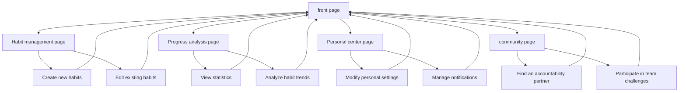

# Product Requirements Document

This English-named file mirrors the companion PRD for easier navigation by international readers.

---

# Habit Tracker Product Requirements Document

## 1. Product overview

Habit Tracker is a modernWebApplication designed to help users establish and maintain good living habits. The product combines behavioral science principles and modern gamification design to provide users with a simple and effective habit management experience.

The product solves the problem of users' lack of continuous motivation and effective tracking in the process of habit formation, and helps users establish long-term behavioral changes through scientific feedback mechanisms and incentive systems. The goal is to become an indispensable self-improvement tool in users' daily lives and establish a differentiated advantage in the highly competitive habit tracking market.

## 2. Core functions

### 2.1 user role

| Role | Registration method | Core permissions |
|------|----------|----------|
| Ordinary user | Email registration or social login | Create and track basic habits and view personal progress |
| advanced user | Subscription upgrade | Unlock advanced features likeAICoaching, team challenges, detailed analysis |

### 2.2 Function module

Our habit tracker consists of the following core pages:

1. **Home page**: User dashboard, today's habit overview, and quick check-in
2. **Habit management page**: Create habits, edit settings, and manage categories
3. **Progress analytics page**: Data visualization, streak statistics, and trend analysis
4. **Profile page**: User settings, notification preferences, and account management
5. **Community page**: Accountability partners, team challenges, and progress sharing

### 2.3 Page details

| Page name | module name | Function description |
|----------|----------|----------|
| front page | User Dashboard | Displays today’s to-be-completed habits, continuous recording overview, and quick operation buttons |
| front page | Today's habits | One-click sign-in to complete habits, check today's progress, and switch habit status |
| front page | motivational elements | Continuous record display, achievement badges, and progress bar visualization |
| Habit management page | Habit creation | Set habit name, choose icon, configure recurrence rules (daily/weekly/custom) |
| Habit management page | Habit classification | Supports the management of positive habits (which need to be developed) and negative habits (which need to be quit) |
| Habit management page | Reminder settings | Configure time reminders, customized notification copy, and reminder frequency settings |
| Progress analysis page | data visualization | Calendar heat map, trend chart, completion rate statistics |
| Progress analysis page | continuous recording | The current number of consecutive days, the best record in history, and the ranking of consecutive records |
| Progress analysis page | Habit insights | Complete pattern analysis, best time period identification, and improvement suggestions |
| Personal center page | User settings | Personal information editing, preference settings, privacy control |
| Personal center page | Notification management | Push notification switch, reminder time setting, notification type selection |
| Personal center page | Data management | Data export, backup and recovery, account deletion |
| community page | accountability partner | Add friends, share progress, and encourage each other with messages |
| community page | Team Challenge | Create or join challenges, team leaderboards, collective goals |
| community page | Achievements shared | Milestone celebrations, community updates, likes and comments |

## 3. core process

### Ordinary user flow
After users access the app for the first time, they go through a simple onboarding process to create an account and set up their first habit. Every day, users open the app to check the habits to be completed today, and complete the check-in with one click. Users can view their continuous records and progress statistics to gain a sense of accomplishment and continuous motivation. When users need to adjust their habits or view detailed analysis, they can enter the corresponding management and analysis page.

### Advanced user flow
In addition to all the functions of ordinary users, advanced users can also accessAIGet personalized advice with coaching, interact with other users in team challenges, and use advanced analytics to gain deeper insights into your habit patterns.

## 4. user interface design

### 4.1 design style

- **Primary color**: Fresh teal (`#10B981`) as the primary brand color, conveying growth and vitality
- **Secondary color**: Warm orange (`#F59E0B`) for emphasis and reward states
- **Button style**: Rounded corners (`8px` border radius) with a modern, clean flat style
- **Typography**: Inter font family, with `14px` as the base text size and `16px` for headings
- **Layout style**: Card-based layout with a top navigation bar and responsive grid system
- **Icon style**: Uses the `Heroicons` library with a consistent outline style

### 4.2 Page design overview

| Page name | module name | UIelement |
|----------|----------|--------|
| front page | User Dashboard | Clean white background, card layout, green progress bar, round avatar |
| front page | Today's habits | Large checkbox, habit icon, continuous recording number badge, swipe gesture support |
| Habit management page | Habit creation | Modal dialog, icon picker, color picker, form validation prompt |
| Progress analysis page | data visualization | Chart.jsCharts, calendar heat maps, gradient progress rings, animated transitions |
| Personal center page | Setting interface | List layout, switch component, group title, right arrow navigation |
| community page | social function | User avatar grid, activity timeline, like button, comment bubble |

### 4.3 Responsive design

The product follows a mobile-first responsive design strategy to ensure a strong experience on phones, tablets, and desktops. Touch interactions should use appropriately sized targets (minimum `44px`) and support gesture-based actions. The desktop version should take advantage of larger screens for richer data presentation and multi-column layouts.
