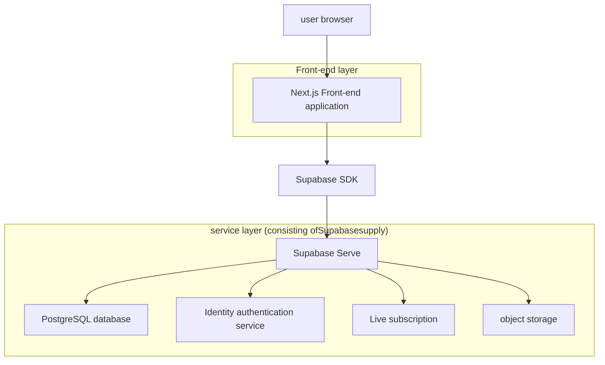
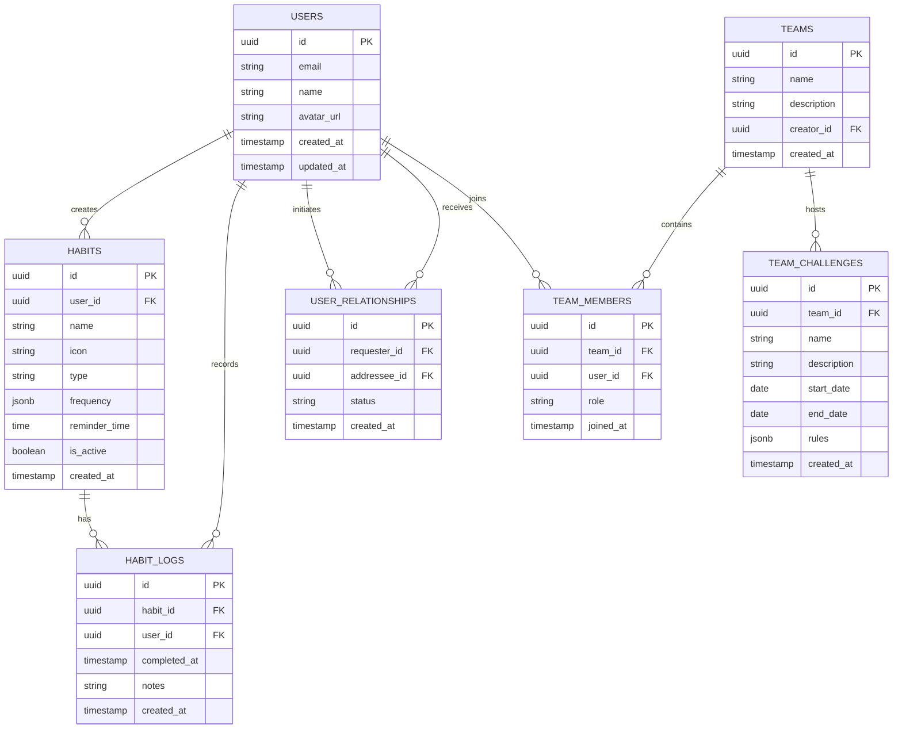

# Technical Architecture Document

This English-named file mirrors the companion architecture document for easier navigation by international readers.

---

# Habit tracker technical architecture documentation

## 1. Architecture design



## 2. Technical description

- Frontend:Next.js@14 + React@18 + TypeScript + Tailwind CSS@3 + Framer Motion
- rear end:Supabase (PostgreSQL + Identity authentication + real-time function)
- Deployment:Vercel (front end) + Supabase Cloud (backend services)
- Status management:Zustand
- UIComponents:Headless UI + Heroicons
- Chart library:Chart.js + React-Chartjs-2
- notify:Web Push API + Supabase Edge Functions

## 3. route definition

| routing | use |
|------|------|
| / | Home page, showing user dashboard and overview of today's habits |
| /habits | Habit management page, create and edit habits |
| /analytics | Progress analysis page, data visualization and statistics |
| /profile | Personal center, user settings and account management |
| /community | Community page, accountability partners and team challenges |
| /auth/login | Login page, user authentication |
| /auth/register | Registration page, new user account creation |
| /onboarding | Guidance page, first-time user guide |

## 4. APIdefinition

### 4.1 coreAPI

**User authentication related**
```
POST /auth/v1/signup
```

Request parameters:
| Parameter name | Parameter type | Is it necessary | describe |
|--------|----------|----------|------|
| email | string | true | User email address |
| password | string | true | User password |
| name | string | true | User name |

response:
| Parameter name | Parameter type | describe |
|--------|----------|------|
| user | object | User information object |
| session | object | session information |

**Habit management related**
```
POST /rest/v1/habits
```

Request parameters:
| Parameter name | Parameter type | Is it necessary | describe |
|--------|----------|----------|------|
| name | string | true | customary name |
| icon | string | false | Habit icon |
| type | string | true | Habit type (positive/negative) |
| frequency | object | true | Repeat frequency configuration |
| reminder_time | string | false | reminder time |

Response example:
```json
{
  "id": "uuid",
  "name": "daily reading",
  "icon": "book",
  "type": "positive",
  "frequency": {
    "type": "daily",
    "days": [1,2,3,4,5,6,7]
  },
  "created_at": "2024-01-01T00:00:00Z"
}
```

**Habit record related**
```
POST /rest/v1/habit_logs
```

Request parameters:
| Parameter name | Parameter type | Is it necessary | describe |
|--------|----------|----------|------|
| habit_id | uuid | true | HabitID |
| completed_at | timestamp | true | completion time |
| notes | string | false | Remarks |

## 5. data model

### 5.1 Data model definition



### 5.2 data definition language

**User table (users)**
```sql
-- User table consists ofSupabase AuthAutomatically create and manage
--Extended user configuration table
CREATE TABLE user_profiles (
    id UUID PRIMARY KEY REFERENCES auth.users(id) ON DELETE CASCADE,
    name VARCHAR(100) NOT NULL,
    avatar_url TEXT,
    timezone VARCHAR(50) DEFAULT 'UTC',
    notification_enabled BOOLEAN DEFAULT true,
    created_at TIMESTAMP WITH TIME ZONE DEFAULT NOW(),
    updated_at TIMESTAMP WITH TIME ZONE DEFAULT NOW()
);

-- Enable row-level security
ALTER TABLE user_profiles ENABLE ROW LEVEL SECURITY;

-- Create a policy
CREATE POLICY "Users can view own profile" ON user_profiles
    FOR SELECT USING (auth.uid() = id);

CREATE POLICY "Users can update own profile" ON user_profiles
    FOR UPDATE USING (auth.uid() = id);
```

**habit list (habits)**
```sql
CREATE TABLE habits (
    id UUID PRIMARY KEY DEFAULT gen_random_uuid(),
    user_id UUID NOT NULL REFERENCES auth.users(id) ON DELETE CASCADE,
    name VARCHAR(100) NOT NULL,
    icon VARCHAR(50) DEFAULT 'star',
    type VARCHAR(20) NOT NULL CHECK (type IN ('positive', 'negative')),
    frequency JSONB NOT NULL DEFAULT '{"type": "daily", "days": [1,2,3,4,5,6,7]}',
    reminder_time TIME,
    is_active BOOLEAN DEFAULT true,
    created_at TIMESTAMP WITH TIME ZONE DEFAULT NOW(),
    updated_at TIMESTAMP WITH TIME ZONE DEFAULT NOW()
);

-- Create index
CREATE INDEX idx_habits_user_id ON habits(user_id);
CREATE INDEX idx_habits_active ON habits(user_id, is_active);

-- Enable row-level security
ALTER TABLE habits ENABLE ROW LEVEL SECURITY;

-- Create a policy
CREATE POLICY "Users can manage own habits" ON habits
    FOR ALL USING (auth.uid() = user_id);

-- Authorize
GRANT SELECT ON habits TO anon;
GRANT ALL PRIVILEGES ON habits TO authenticated;
```

**Habit record sheet (habit_logs)**
```sql
CREATE TABLE habit_logs (
    id UUID PRIMARY KEY DEFAULT gen_random_uuid(),
    habit_id UUID NOT NULL REFERENCES habits(id) ON DELETE CASCADE,
    user_id UUID NOT NULL REFERENCES auth.users(id) ON DELETE CASCADE,
    completed_at TIMESTAMP WITH TIME ZONE NOT NULL,
    notes TEXT,
    created_at TIMESTAMP WITH TIME ZONE DEFAULT NOW()
);

-- Create index
CREATE INDEX idx_habit_logs_habit_id ON habit_logs(habit_id);
CREATE INDEX idx_habit_logs_user_id ON habit_logs(user_id);
CREATE INDEX idx_habit_logs_completed_at ON habit_logs(completed_at DESC);

-- Create unique constraints (prevent duplicate records on the same day)
CREATE UNIQUE INDEX idx_habit_logs_unique_daily ON habit_logs(habit_id, DATE(completed_at));

-- Enable row-level security
ALTER TABLE habit_logs ENABLE ROW LEVEL SECURITY;

-- Create a policy
CREATE POLICY "Users can manage own habit logs" ON habit_logs
    FOR ALL USING (auth.uid() = user_id);

-- Authorize
GRANT SELECT ON habit_logs TO anon;
GRANT ALL PRIVILEGES ON habit_logs TO authenticated;
```

**User relationship table (user_relationships)**
```sql
CREATE TABLE user_relationships (
    id UUID PRIMARY KEY DEFAULT gen_random_uuid(),
    requester_id UUID NOT NULL REFERENCES auth.users(id) ON DELETE CASCADE,
    addressee_id UUID NOT NULL REFERENCES auth.users(id) ON DELETE CASCADE,
    status VARCHAR(20) NOT NULL DEFAULT 'pending' CHECK (status IN ('pending', 'accepted', 'rejected')),
    created_at TIMESTAMP WITH TIME ZONE DEFAULT NOW(),
    updated_at TIMESTAMP WITH TIME ZONE DEFAULT NOW()
);

-- Create a unique constraint
CREATE UNIQUE INDEX idx_user_relationships_unique ON user_relationships(requester_id, addressee_id);

-- Enable row-level security
ALTER TABLE user_relationships ENABLE ROW LEVEL SECURITY;

-- Create a policy
CREATE POLICY "Users can manage own relationships" ON user_relationships
    FOR ALL USING (auth.uid() = requester_id OR auth.uid() = addressee_id);

-- Authorize
GRANT ALL PRIVILEGES ON user_relationships TO authenticated;
```

**initialization data**
```sql
-- Create a trigger function to automatically update timestamps
CREATE OR REPLACE FUNCTION update_updated_at_column()
RETURNS TRIGGER AS $$
BEGIN
    NEW.updated_at = NOW();
    RETURN NEW;
END;
$$ language 'plpgsql';

-- Add update timestamp trigger for related tables
CREATE TRIGGER update_user_profiles_updated_at BEFORE UPDATE ON user_profiles
    FOR EACH ROW EXECUTE FUNCTION update_updated_at_column();

CREATE TRIGGER update_habits_updated_at BEFORE UPDATE ON habits
    FOR EACH ROW EXECUTE FUNCTION update_updated_at_column();

CREATE TRIGGER update_user_relationships_updated_at BEFORE UPDATE ON user_relationships
    FOR EACH ROW EXECUTE FUNCTION update_updated_at_column();
```