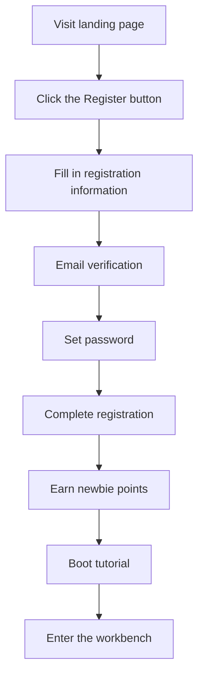
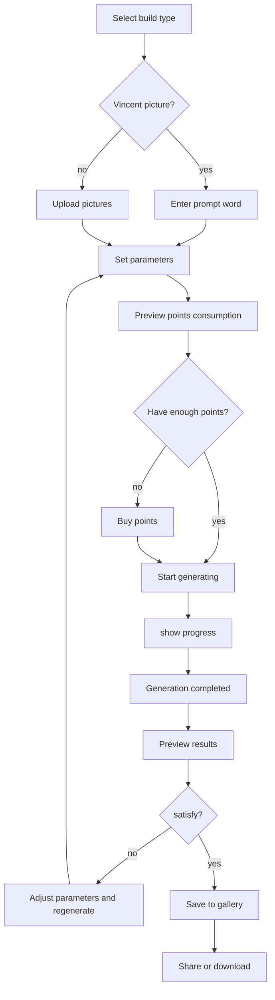
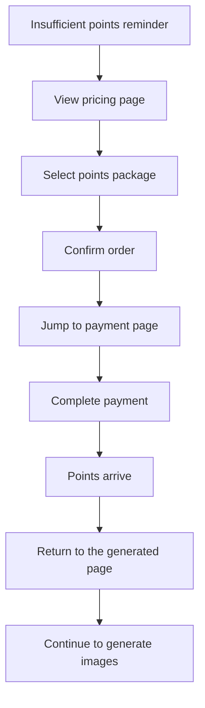

# AI Image generation platform - page architecture design

## 1. Overall architecture overview

### 1.1 Page hierarchy
```
root directory (/)
├── Landing page (/)
├── Authentication page
│   ├── Log in (/login)
│   ├── register (/register)
│   └── forget the password (/forgot-password)
├── Main application area (requires login)
│   ├── Generate workbench (/studio)
│   │   ├── Vincentian Pictures (/studio/text-to-image)
│   │   ├── Tushengtu (/studio/image-to-image)
│   │   └── style transfer (/studio/style-transfer)
│   ├── Library management (/gallery)
│   ├── User Center (/profile)
│   │   ├── personal information (/profile/settings)
│   │   ├── Points management (/profile/credits)
│   │   ├── Order History (/profile/orders)
│   │   └── Usage Statistics (/profile/statistics)
│   └── Pricing page (/pricing)
└── Other pages
    ├── Help Center (/help)
    ├── Privacy Policy (/privacy)
    └── Terms of Service (/terms)
```

## 2. Page detailed design

### 2.1 Landing page (/)

#### Page structure
```
┌─────────────────────────────────────┐
│              Navigation bar                  │
│  Logo  |  Function  |  Pricing  |  Login/Register  │
├─────────────────────────────────────┤
│              hero area                │
│        main title + subtitle + CTA         │
│            Product demonstration video              │
├─────────────────────────────────────┤
│              Function display                │
│    Vincentian picture  |  Tu Sheng Tu  |  style transfer     │
├─────────────────────────────────────┤
│              User case                │
│        Display of usage scenarios for creative workers         │
├─────────────────────────────────────┤
│              Pricing information                │
│          Points package price comparison table            │
├─────────────────────────────────────┤
│              Footer information                │
│      Contact information | legal information | social media    │
└─────────────────────────────────────┘
```

#### key components
- **HeroSection**: Main value proposition presentation
- **FeatureShowcase**: Core function demonstration
- **TestimonialSection**: User reviews and cases
- **PricingPreview**: Pricing information preview
- **CTASection**: call to action button

### 2.2 Generate workbench (/studio)

#### overall layout
```
┌─────────────────────────────────────┐
│              top navigation                │
│  Logo | workbench | Gallery | integral | avatar   │
├─────────────────────────────────────┤
│  sidebar  │        main work area         │
│         │                          │
│ Function selection │      Parameter setting panel         │
│         │                          │
│ - Vincentian picture │    ┌─────────────────┐    │
│ - Tu Sheng Tu │    │                 │    │
│ - style   │    │   preview area       │    │
│         │    │                 │    │
│ History │    └─────────────────┘    │
│         │                          │
│         │      Generate button area         │
└─────────┴──────────────────────────┘
```

#### Core component design

##### Vincent diagram interface components
```typescript
// TextToImagePanel Component structure
interface TextToImagePanelProps {
  onGenerate: (params: GenerationParams) => void;
  isGenerating: boolean;
  userCredits: number;
}

// Components include:
- PromptInput: Prompt word input box
- StyleSelector: style selector
- ParameterControls: Parameter adjustment panel
  - Size selection (512x512, 768x768, 1024x1024)
  - Quality settings (standard/high quality)
  - Number generated (1-4 photos)
- CreditCalculator: Points consumption calculator
- GenerateButton: Generate button
```

##### Picture interface components
```typescript
// ImageToImagePanel Component structure
interface ImageToImagePanelProps {
  onGenerate: (params: ImageGenerationParams) => void;
  isGenerating: boolean;
}

// Components include:
- ImageUploader: Image upload component
- PromptInput: Edit word
- StrengthSlider: Edit intensity slider
- MaskEditor: Local editing mask tool
- PreviewComparison: Original image comparison preview
```

### 2.3 Library management (/gallery)

#### Page layout
```
┌─────────────────────────────────────┐
│              top toolbar              │
│  search box | filter | sort | Batch operations    │
├─────────────────────────────────────┤
│              Picture grid                │
│  ┌───┐ ┌───┐ ┌───┐ ┌───┐ ┌───┐    │
│  │   │ │   │ │   │ │   │ │   │    │
│  │ 1 │ │ 2 │ │ 3 │ │ 4 │ │ 5 │    │
│  │   │ │   │ │   │ │   │ │   │    │
│  └───┘ └───┘ └───┘ └───┘ └───┘    │
│  ┌───┐ ┌───┐ ┌───┐ ┌───┐ ┌───┐    │
│  │ 6 │ │ 7 │ │ 8 │ │ 9 │ │10 │    │
│  └───┘ └───┘ └───┘ └───┘ └───┘    │
├─────────────────────────────────────┤
│              Paginated navigation                │
│        ← Previous page 1 2 3 Next page →     │
└─────────────────────────────────────┘
```

#### key functional components
- **ImageGrid**: Responsive image grid
- **ImageCard**: single picture card
- **FilterPanel**: filter panel
- **SearchBar**: Search function
- **BatchActions**: Batch operation tools

### 2.4 User Center (/profile)

#### Tab layout
```
┌─────────────────────────────────────┐
│          User information header                │
│    avatar | username | Points balance | grade    │
├─────────────────────────────────────┤
│              Navigation tags                │
│ personal settings|Points management|Order history|usage statistics   │
├─────────────────────────────────────┤
│              content area                │
│                                     │
│          Display based on selected tag            │
│            corresponding content               │
│                                     │
└─────────────────────────────────────┘
```

#### Usage statistics page (/profile/statistics)

##### Page layout
```
┌─────────────────────────────────────┐
│              Statistical overview                │
│  Total number of generations | Generated this month | Points consumption | save time │
├─────────────────────────────────────┤
│              Monthly Trend Chart              │
│    ┌─────────────────────────────┐   │
│    │                             │   │
│    │      Generate quantity trend graph          │   │
│    │                             │   │
│    └─────────────────────────────┘   │
├─────────────────────────────────────┤
│  Points consumption analysis  │    Generate type distribution     │
│  ┌───────────┐  │  ┌─────────────┐   │
│  │           │  │  │             │   │
│  │ Consumption trend chart │  │  │  pie chart      │   │
│  │           │  │  │             │   │
│  └───────────┘  │  └─────────────┘   │
├─────────────────────────────────────┤
│              Generate history list            │
│  time | type | prompt word | Consume points | state │
│  ────────────────────────────────── │
│  [Paginated display of recent generation records]            │
└─────────────────────────────────────┘
```

##### Core component design

**StatisticsOverview components**
```typescript
interface StatisticsOverviewProps {
  totalGenerations: number;
  monthlyGenerations: number;
  totalCreditsUsed: number;
  timeSaved: number; // in hours
}

// Display four key indicator cards
- TotalGenerationsCard: total generated quantity
- MonthlyGenerationsCard: Number generated this month
- CreditsUsedCard: Accumulated points consumption
- TimeSavedCard: Saved creative time
```

**MonthlyTrendChart components**
```typescript
interface MonthlyTrendChartProps {
  data: {
    month: string;
    generations: number;
    creditsUsed: number;
  }[];
  timeRange: '3months' | '6months' | '1year';
}

// use Chart.js or Recharts realize
- Line chart showing monthly generation quantity trends
- doubleYThe axes show the amount generated and points consumed
-Support time range switching
- Hover over data points to show detailed information
```

**CreditsAnalysisChart components**
```typescript
interface CreditsAnalysisProps {
  data: {
    date: string;
    amount: number;
    type: 'usage' | 'purchase' | 'bonus';
  }[];
}

// Points consumption analysis chart
- Bar chart showing daily/weekly points consumption
- Different colors distinguish consumption types
-Support time granularity switching (day/week/month)
```

**GenerationTypeDistribution components**
```typescript
interface GenerationTypeDistributionProps {
  data: {
    type: 'text2img' | 'img2img' | 'style_transfer';
    count: number;
    percentage: number;
  }[];
}

// Generate type distribution pie chart
- Display the proportion of each type of generation
- Hover to show specific amounts and percentages
- Supports clicking to filter history
```

**GenerationHistoryTable components**
```typescript
interface GenerationHistoryTableProps {
  data: {
    id: string;
    createdAt: string;
    type: string;
    prompt: string;
    creditsUsed: number;
    status: 'completed' | 'failed';
    imageUrl?: string;
  }[];
  pagination: {
    page: number;
    limit: number;
    total: number;
  };
  onPageChange: (page: number) => void;
  onFilter: (filters: GenerationFilters) => void;
}

// Generate history table
- Display history in pages
- Supports filtering by type, status, and time
- Click on the record to view detailed information
- Support batch operations (delete, export)
```

##### Data acquisition interface

**Statistics API**
```typescript
// GET /api/users/statistics
interface UserStatistics {
  overview: {
    totalGenerations: number;
    monthlyGenerations: number;
    totalCreditsUsed: number;
    timeSaved: number;
  };
  monthlyTrend: {
    month: string;
    generations: number;
    creditsUsed: number;
  }[];
  creditsAnalysis: {
    date: string;
    amount: number;
    type: string;
  }[];
  typeDistribution: {
    type: string;
    count: number;
    percentage: number;
  }[];
}
```

**Build history API**
```typescript
// GET /api/users/generation-history
interface GenerationHistoryResponse {
  data: GenerationRecord[];
  pagination: {
    page: number;
    limit: number;
    total: number;
    totalPages: number;
  };
}

interface GenerationFilters {
  type?: string;
  status?: string;
  dateFrom?: string;
  dateTo?: string;
  search?: string;
}
```

## 3. User flow design

### 3.1 New user registration process



**Detailed steps**:
1. **Landing page attracts** - Demonstrate product value and guide registration
2. **Information collection** - Email, username, password
3. **Email verification** - Send a verification link to confirm the validity of the email
4. **welcome bonus** - Give away 10 novice points
5. **Product guidance** - Interactive tutorial demonstrating core functionality
6. **first experience** - Guide to complete first image generation

### 3.2 Image generation core process



### 3.3 Points purchase process



## 4. Responsive design guidelines

### 4.1 Breakpoint settings
```css
/* mobile device */
@media (max-width: 768px) {
  /* Single column layout, sidebar collapsed */
}

/* Tablet device */
@media (min-width: 769px) and (max-width: 1024px) {
  /* Two-column layout, some functions simplified */
}

/* Desktop */
@media (min-width: 1025px) {
  /* Complete functional layout */
}
```

### 4.2 Mobile terminal adaptation

#### Workbench mobile layout
```
┌─────────────────┐
│    top navigation      │
├─────────────────┤
│    Function tag      │
│ Vincentian picture|Tu Sheng Tu|style │
├─────────────────┤
│                │
│   Parameter setting area     │
│                │
├─────────────────┤
│                │
│    preview area      │
│                │
├─────────────────┤
│    Generate button      │
└─────────────────┘
```

## 5. Component library design

### 5.1 Basic components

#### Button components
```typescript
interface ButtonProps {
  variant: 'primary' | 'secondary' | 'outline' | 'ghost';
  size: 'sm' | 'md' | 'lg';
  loading?: boolean;
  disabled?: boolean;
  icon?: ReactNode;
  children: ReactNode;
  onClick?: () => void;
}
```

#### Input components
```typescript
interface InputProps {
  type: 'text' | 'email' | 'password' | 'number';
  placeholder?: string;
  value: string;
  onChange: (value: string) => void;
  error?: string;
  label?: string;
  required?: boolean;
}
```

### 5.2 business components

#### ImageUploader components
```typescript
interface ImageUploaderProps {
  onUpload: (file: File) => void;
  maxSize: number; // MB
  acceptedTypes: string[];
  preview?: boolean;
}
```

#### CreditDisplay components
```typescript
interface CreditDisplayProps {
  current: number;
  required: number;
  onPurchase: () => void;
}
```

## 6. State management architecture

### 6.1 global state (Zustand)
```typescript
interface AppState {
  // User status
  user: User | null;
  credits: number;
  
  // UI state
  sidebarOpen: boolean;
  theme: 'light' | 'dark';
  
  // Build status
  isGenerating: boolean;
  generationQueue: GenerationTask[];
  
  // How to operate
  setUser: (user: User) => void;
  updateCredits: (credits: number) => void;
  toggleSidebar: () => void;
}
```

### 6.2 server status (React Query)
```typescript
// Image related queries
const useImages = () => useQuery(['images'], fetchImages);
const useGenerateImage = () => useMutation(generateImage);

// User related queries
const useProfile = () => useQuery(['profile'], fetchProfile);
const usePurchaseCredits = () => useMutation(purchaseCredits);
```

## 7. Performance optimization strategies

### 7.1 Image optimization
- **Lazy loading**: use Intersection Observer
- **progressive loading**: Display thumbnails first, then load high-definition images
- **Format optimization**: WebP format takes precedence, downgraded to JPEG
- **CDN accelerate**: Picture resources CDN distribution

### 7.2 code splitting
```typescript
// Route level code splitting
const Studio = lazy(() => import('./pages/Studio'));
const Gallery = lazy(() => import('./pages/Gallery'));
const Profile = lazy(() => import('./pages/Profile'));

// Component level code splitting
const ImageEditor = lazy(() => import('./components/ImageEditor'));
```

### 7.3 caching strategy
- **browser cache**: Long-term caching of static resources
- **API cache**: React Query Smart caching
- **Image cache**: Service Worker caching strategy

## 8. Accessibility (A11y)

### 8.1 Keyboard navigation
- All interactive elements supported Tab key navigation
- clear focus indicator
- Shortcut key support (Ctrl+Enter generate image)

### 8.2 Screen reader support
- Semantic HTML Label
- ARIA Tags and attributes
- pictures alt text description

### 8.3 visual aid
- High contrast mode
- Font size adjustment
- Color blind friendly color scheme

---

**Document version**: v1.0  
**Creation date**: 2024January  
**person in charge**: Front-end team
