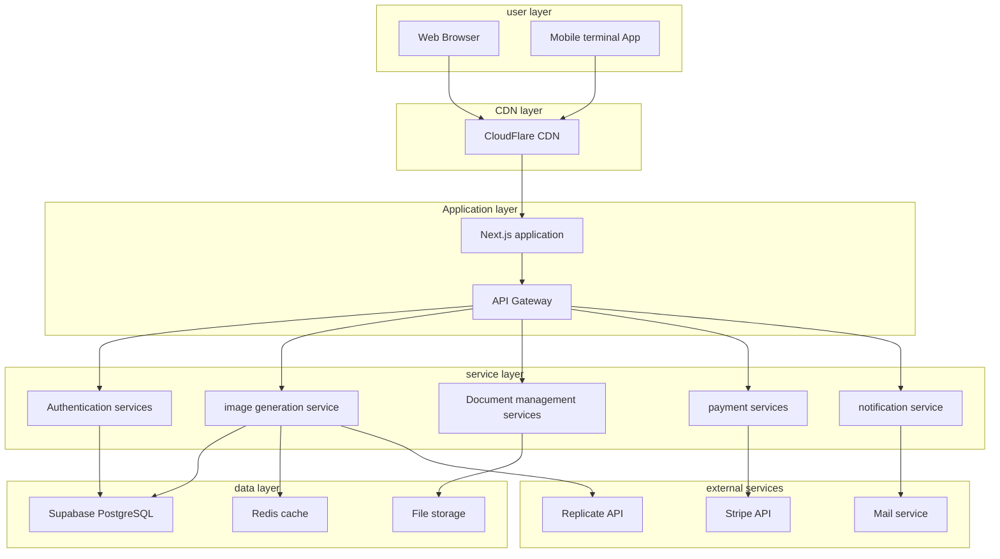

# AI Image generation platform - technical implementation plan and development plan

## 1. Technical architecture design

### 1.1 overall architecture



### 1.2 Technology stack selection

#### Front-end technology stack
```typescript
// core framework
- Next.js 14 (App Router)
- React 18
- TypeScript 5.0+

// style and UI
- Tailwind CSS 3.0+
- Headless UI
- Framer Motion (animation)
- Lucide React (icon)

// state management
- Zustand (global status)
- React Query (server status)
- React Hook Form (form status)

// tool library
- Axios (HTTP client)
- Date-fns (date processing)
- Zod (data validation)
- Sharp (image processing)
```

#### Backend technology stack
```typescript
// Runtime and framework
- Node.js 18+
- Next.js API Routes
- Serverless Functions

// Database and storage
- Supabase (PostgreSQL + Auth + Storage)
- Redis (cache and session)

// external service
- Replicate API (AI Model)
- Stripe (payment processing)
- Resend (mail service)

// Tools and middleware
- Prisma (ORM)
- Jose (JWT deal with)
- Bcrypt (Password encryption)
- Multer (file upload)
```

#### Deployment and operation
```yaml
# Deployment platform
- Vercel (main application)
- Supabase (database and storage)
- Upstash (Redis)

# Monitor and analyze
- Vercel Analytics
- Sentry (error monitoring)
- LogRocket (user behavior)

# CI/CD
- GitHub Actions
- Vercel Automatic deployment
```

### 1.3 Database design

#### Core table structure

```sql
-- User table
CREATE TABLE users (
  id UUID PRIMARY KEY DEFAULT gen_random_uuid(),
  email VARCHAR(255) UNIQUE NOT NULL,
  password_hash VARCHAR(255) NOT NULL,
  name VARCHAR(100) NOT NULL,
  avatar_url TEXT,
  credits INTEGER DEFAULT 10, -- Bonus points for new users
  subscription_tier VARCHAR(20) DEFAULT 'free',
  email_verified BOOLEAN DEFAULT false,
  preferences JSONB DEFAULT '{}',
  last_login_at TIMESTAMP,
  created_at TIMESTAMP DEFAULT NOW(),
  updated_at TIMESTAMP DEFAULT NOW()
);

-- image table
CREATE TABLE images (
  id UUID PRIMARY KEY DEFAULT gen_random_uuid(),
  user_id UUID NOT NULL REFERENCES users(id) ON DELETE CASCADE,
  title VARCHAR(200),
  prompt TEXT NOT NULL,
  negative_prompt TEXT,
  image_url TEXT NOT NULL,
  thumbnail_url TEXT NOT NULL,
  width INTEGER NOT NULL,
  height INTEGER NOT NULL,
  generation_type VARCHAR(20) NOT NULL, -- text2img, img2img, style_transfer
  parameters JSONB NOT NULL,
  credits_used INTEGER NOT NULL,
  is_public BOOLEAN DEFAULT false,
  is_nsfw BOOLEAN DEFAULT false,
  tags TEXT[] DEFAULT '{}',
  metadata JSONB DEFAULT '{}',
  created_at TIMESTAMP DEFAULT NOW(),
  updated_at TIMESTAMP DEFAULT NOW()
);

-- Generate task list
CREATE TABLE generation_tasks (
  id UUID PRIMARY KEY DEFAULT gen_random_uuid(),
  user_id UUID NOT NULL REFERENCES users(id) ON DELETE CASCADE,
  type VARCHAR(20) NOT NULL,
  status VARCHAR(20) DEFAULT 'pending', -- pending, processing, completed, failed
  prompt TEXT NOT NULL,
  parameters JSONB NOT NULL,
  credits_required INTEGER NOT NULL,
  replicate_prediction_id VARCHAR(255),
  result_images JSONB,
  error_message TEXT,
  progress INTEGER DEFAULT 0,
  started_at TIMESTAMP,
  completed_at TIMESTAMP,
  created_at TIMESTAMP DEFAULT NOW()
);

-- Points transaction table
CREATE TABLE credit_transactions (
  id UUID PRIMARY KEY DEFAULT gen_random_uuid(),
  user_id UUID NOT NULL REFERENCES users(id) ON DELETE CASCADE,
  amount INTEGER NOT NULL, -- Positive numbers represent increases, negative numbers represent consumption.
  type VARCHAR(20) NOT NULL, -- purchase, usage, refund, bonus
  description TEXT NOT NULL,
  related_id UUID, -- associated ordersIDor generate tasksID
  stripe_payment_id VARCHAR(255),
  metadata JSONB DEFAULT '{}',
  created_at TIMESTAMP DEFAULT NOW()
);

-- order form
CREATE TABLE orders (
  id UUID PRIMARY KEY DEFAULT gen_random_uuid(),
  user_id UUID NOT NULL REFERENCES users(id) ON DELETE CASCADE,
  package_id VARCHAR(50) NOT NULL,
  credits INTEGER NOT NULL,
  amount DECIMAL(10,2) NOT NULL,
  currency VARCHAR(3) DEFAULT 'CNY',
  status VARCHAR(20) DEFAULT 'pending', -- pending, paid, failed, refunded
  stripe_payment_intent_id VARCHAR(255),
  stripe_session_id VARCHAR(255),
  paid_at TIMESTAMP,
  created_at TIMESTAMP DEFAULT NOW(),
  updated_at TIMESTAMP DEFAULT NOW()
);
```

#### Index optimization

```sql
-- User related index
CREATE INDEX idx_users_email ON users(email);
CREATE INDEX idx_users_created_at ON users(created_at);

-- Image related index
CREATE INDEX idx_images_user_id ON images(user_id);
CREATE INDEX idx_images_created_at ON images(created_at DESC);
CREATE INDEX idx_images_generation_type ON images(generation_type);
CREATE INDEX idx_images_is_public ON images(is_public) WHERE is_public = true;
CREATE INDEX idx_images_tags ON images USING GIN(tags);
CREATE INDEX idx_images_search ON images USING GIN(to_tsvector('english', title || ' ' || prompt));

-- Generate task index
CREATE INDEX idx_generation_tasks_user_id ON generation_tasks(user_id);
CREATE INDEX idx_generation_tasks_status ON generation_tasks(status);
CREATE INDEX idx_generation_tasks_created_at ON generation_tasks(created_at DESC);

-- Points Transaction Index
CREATE INDEX idx_credit_transactions_user_id ON credit_transactions(user_id);
CREATE INDEX idx_credit_transactions_type ON credit_transactions(transaction_type);
CREATE INDEX idx_credit_transactions_created_at ON credit_transactions(created_at DESC);
```

## 2. Core function implementation

### 2.1 User authentication system

#### JWT Token accomplish

```typescript
// lib/auth.ts
import { SignJWT, jwtVerify } from 'jose';
import { cookies } from 'next/headers';

const secret = new TextEncoder().encode(process.env.JWT_SECRET!);

export async function createToken(payload: any) {
  return await new SignJWT(payload)
    .setProtectedHeader({ alg: 'HS256' })
    .setIssuedAt()
    .setExpirationTime('1h')
    .sign(secret);
}

export async function verifyToken(token: string) {
  try {
    const { payload } = await jwtVerify(token, secret);
    return payload;
  } catch (error) {
    return null;
  }
}

export async function getUser() {
  const cookieStore = cookies();
  const token = cookieStore.get('token')?.value;
  
  if (!token) return null;
  
  const payload = await verifyToken(token);
  return payload?.userId ? await getUserById(payload.userId) : null;
}
```

#### Middleware protection

```typescript
// middleware.ts
import { NextResponse } from 'next/server';
import type { NextRequest } from 'next/server';
import { verifyToken } from './lib/auth';

export async function middleware(request: NextRequest) {
  const { pathname } = request.nextUrl;
  
  // Path that requires authentication
  const protectedPaths = ['/studio', '/gallery', '/profile'];
  const isProtectedPath = protectedPaths.some(path => pathname.startsWith(path));
  
  if (isProtectedPath) {
    const token = request.cookies.get('token')?.value;
    
    if (!token) {
      return NextResponse.redirect(new URL('/login', request.url));
    }
    
    const payload = await verifyToken(token);
    if (!payload) {
      return NextResponse.redirect(new URL('/login', request.url));
    }
  }
  
  return NextResponse.next();
}

export const config = {
  matcher: ['/((?!api|_next/static|_next/image|favicon.ico).*)'],
};
```

### 2.2 image generation service

#### Replicate API integrated

```typescript
// lib/replicate.ts
import Replicate from 'replicate';

const replicate = new Replicate({
  auth: process.env.REPLICATE_API_TOKEN!,
});

export interface GenerationParams {
  prompt: string;
  negative_prompt?: string;
  width: number;
  height: number;
  num_outputs: number;
  guidance_scale: number;
  num_inference_steps: number;
  seed?: number;
}

export async function generateTextToImage(params: GenerationParams) {
  try {
    const prediction = await replicate.predictions.create({
      version: process.env.REPLICATE_MODEL_VERSION!,
      input: {
        prompt: params.prompt,
        negative_prompt: params.negative_prompt || '',
        width: params.width,
        height: params.height,
        num_outputs: params.num_outputs,
        guidance_scale: params.guidance_scale,
        num_inference_steps: params.num_inference_steps,
        seed: params.seed,
      },
    });
    
    return prediction;
  } catch (error) {
    console.error('Replicate API error:', error);
    throw new Error('Image generation failed');
  }
}

export async function getPredictionStatus(predictionId: string) {
  try {
    const prediction = await replicate.predictions.get(predictionId);
    return prediction;
  } catch (error) {
    console.error('Failed to get prediction status:', error);
    throw new Error('Failed to get build status');
  }
}
```

#### Build task management

```typescript
// lib/generation-queue.ts
import { supabase } from './supabase';
import { generateTextToImage, getPredictionStatus } from './replicate';

export class GenerationQueue {
  private static instance: GenerationQueue;
  private processing = false;
  
  static getInstance() {
    if (!GenerationQueue.instance) {
      GenerationQueue.instance = new GenerationQueue();
    }
    return GenerationQueue.instance;
  }
  
  async addTask(userId: string, params: any) {
    // Check user points
    const user = await this.getUserCredits(userId);
    if (user.credits < params.creditsRequired) {
      throw new Error('Not enough points');
    }
    
    // Create a build task
    const { data: task } = await supabase
      .from('generation_tasks')
      .insert({
        user_id: userId,
        type: params.type,
        prompt: params.prompt,
        parameters: params.parameters,
        credits_required: params.creditsRequired,
      })
      .select()
      .single();
    
    // Start processing the queue
    this.processQueue();
    
    return task;
  }
  
  private async processQueue() {
    if (this.processing) return;
    this.processing = true;
    
    try {
      // Get pending tasks
      const { data: tasks } = await supabase
        .from('generation_tasks')
        .select('*')
        .eq('status', 'pending')
        .order('created_at', { ascending: true })
        .limit(5);
      
      for (const task of tasks || []) {
        await this.processTask(task);
      }
    } finally {
      this.processing = false;
    }
  }
  
  private async processTask(task: any) {
    try {
      // Update task status to Processing
      await supabase
        .from('generation_tasks')
        .update({ 
          status: 'processing',
          started_at: new Date().toISOString()
        })
        .eq('id', task.id);
      
      // call Replicate API
      const prediction = await generateTextToImage(task.parameters);
      
      // Save predictionID
      await supabase
        .from('generation_tasks')
        .update({ replicate_prediction_id: prediction.id })
        .eq('id', task.id);
      
      // Polling results
      await this.pollPrediction(task.id, prediction.id);
      
    } catch (error) {
      // Processing failed
      await supabase
        .from('generation_tasks')
        .update({ 
          status: 'failed',
          error_message: error.message,
          completed_at: new Date().toISOString()
        })
        .eq('id', task.id);
    }
  }
  
  private async pollPrediction(taskId: string, predictionId: string) {
    const maxAttempts = 60; // Polling for up to 5 minutes
    let attempts = 0;
    
    while (attempts < maxAttempts) {
      const prediction = await getPredictionStatus(predictionId);
      
      if (prediction.status === 'succeeded') {
        await this.handleSuccess(taskId, prediction.output);
        break;
      } else if (prediction.status === 'failed') {
        await this.handleFailure(taskId, prediction.error);
        break;
      }
      
      // Wait 5 seconds and try again
      await new Promise(resolve => setTimeout(resolve, 5000));
      attempts++;
    }
  }
  
  private async handleSuccess(taskId: string, output: string[]) {
    // Upload images to storage
    const imageUrls = await this.uploadImages(output);
    
    // Update task status
    await supabase
      .from('generation_tasks')
      .update({
        status: 'completed',
        result_images: imageUrls,
        completed_at: new Date().toISOString()
      })
      .eq('id', taskId);
    
    // Deduct user points
    await this.deductCredits(taskId);
    
    // Save image to gallery
    await this.saveToGallery(taskId, imageUrls);
  }
}
```

### 2.3 Payment system integration

#### Stripe Payment implementation

```typescript
// lib/stripe.ts
import Stripe from 'stripe';

const stripe = new Stripe(process.env.STRIPE_SECRET_KEY!, {
  apiVersion: '2023-10-16',
});

export const creditPackages = {
  starter: { credits: 100, price: 2900, name: 'starter pack' },
  standard: { credits: 300, price: 7900, name: 'Standard package' },
  professional: { credits: 800, price: 19900, name: 'Professional package' },
  enterprise: { credits: 2000, price: 45900, name: 'Enterprise package' },
};

export async function createPaymentSession(userId: string, packageId: string) {
  const package_ = creditPackages[packageId];
  if (!package_) {
    throw new Error('Invalid points package');
  }
  
  const session = await stripe.checkout.sessions.create({
    payment_method_types: ['card'],
    line_items: [
      {
        price_data: {
          currency: 'cny',
          product_data: {
            name: `${package_.name} - ${package_.credits} integral`,
            description: `Buy ${package_.credits} points for AI image generation`,
          },
          unit_amount: package_.price,
        },
        quantity: 1,
      },
    ],
    mode: 'payment',
    success_url: `${process.env.NEXT_PUBLIC_BASE_URL}/profile/credits?success=true`,
    cancel_url: `${process.env.NEXT_PUBLIC_BASE_URL}/pricing?canceled=true`,
    metadata: {
      userId,
      packageId,
      credits: package_.credits.toString(),
    },
  });
  
  return session;
}

export async function handleWebhook(body: string, signature: string) {
  const event = stripe.webhooks.constructEvent(
    body,
    signature,
    process.env.STRIPE_WEBHOOK_SECRET!
  );
  
  if (event.type === 'checkout.session.completed') {
    const session = event.data.object as Stripe.Checkout.Session;
    await processPayment(session);
  }
}

async function processPayment(session: Stripe.Checkout.Session) {
  const { userId, packageId, credits } = session.metadata!;
  
  // Create order record
  const { data: order } = await supabase
    .from('orders')
    .insert({
      user_id: userId,
      package_id: packageId,
      credits: parseInt(credits),
      amount: session.amount_total! / 100,
      status: 'paid',
      stripe_session_id: session.id,
      paid_at: new Date().toISOString(),
    })
    .select()
    .single();
  
  // Increase user points
  await updateUserCredits(
    userId,
    parseInt(credits),
    'purchase',
    `Purchase points package: ${packageId}`,
    order.id
  );
}
```

### 2.4 file storage system

#### Supabase Storage integrated

```typescript
// lib/storage.ts
import { supabase } from './supabase';
import sharp from 'sharp';

export class StorageService {
  private bucket = 'images';
  
  async uploadImage(file: File, userId: string): Promise<string> {
    // Generate unique file name
    const fileExt = file.name.split('.').pop();
    const fileName = `${userId}/${Date.now()}.${fileExt}`;
    
    // Compress pictures
    const buffer = await file.arrayBuffer();
    const compressedBuffer = await sharp(Buffer.from(buffer))
      .resize(1024, 1024, { fit: 'inside', withoutEnlargement: true })
      .jpeg({ quality: 85 })
      .toBuffer();
    
    // upload to Supabase Storage
    const { data, error } = await supabase.storage
      .from(this.bucket)
      .upload(fileName, compressedBuffer, {
        contentType: 'image/jpeg',
        cacheControl: '3600',
      });
    
    if (error) {
      throw new Error(`Upload failed: ${error.message}`);
    }
    
    // Get public URL
    const { data: { publicUrl } } = supabase.storage
      .from(this.bucket)
      .getPublicUrl(fileName);
    
    return publicUrl;
  }
  
  async generateThumbnail(imageUrl: string): Promise<string> {
    // Download original image
    const response = await fetch(imageUrl);
    const buffer = await response.arrayBuffer();
    
    // Generate thumbnails
    const thumbnailBuffer = await sharp(Buffer.from(buffer))
      .resize(300, 300, { fit: 'cover' })
      .jpeg({ quality: 70 })
      .toBuffer();
    
    // Upload thumbnail
    const fileName = `thumbnails/${Date.now()}.jpg`;
    const { data, error } = await supabase.storage
      .from(this.bucket)
      .upload(fileName, thumbnailBuffer, {
        contentType: 'image/jpeg',
      });
    
    if (error) {
      throw new Error(`Thumbnail generation failed: ${error.message}`);
    }
    
    const { data: { publicUrl } } = supabase.storage
      .from(this.bucket)
      .getPublicUrl(fileName);
    
    return publicUrl;
  }
  
  async deleteImage(url: string): Promise<void> {
    const path = this.extractPathFromUrl(url);
    const { error } = await supabase.storage
      .from(this.bucket)
      .remove([path]);
    
    if (error) {
      throw new Error(`Delete failed: ${error.message}`);
    }
  }
  
  private extractPathFromUrl(url: string): string {
    const urlParts = url.split('/');
    return urlParts.slice(-2).join('/'); // Get userId/filename part
  }
}
```

## 3. Front-end implementation solution

### 3.1 Project structure

```
src/
├── app/                    # Next.js 13+ App Router
│   ├── (auth)/            # Certification related page group
│   │   ├── login/
│   │   ├── register/
│   │   └── layout.tsx
│   ├── studio/            # Generate workbench
│   │   ├── text-to-image/
│   │   ├── image-to-image/
│   │   ├── style-transfer/
│   │   └── layout.tsx
│   ├── gallery/           # Library management
│   ├── profile/           # User Center
│   ├── pricing/           # Pricing page
│   ├── api/              # API routing
│   ├── globals.css
│   ├── layout.tsx
│   └── page.tsx
├── components/            # Reusable components
│   ├── ui/               # Base UI components
│   ├── forms/            # form component
│   ├── layout/           # layout component
│   └── features/         # Functional components
├── lib/                  # Tool functions and configuration
│   ├── auth.ts
│   ├── supabase.ts
│   ├── utils.ts
│   └── validations.ts
├── hooks/                # Customize Hooks
├── store/                # Status management
├── types/                # TypeScript type definition
└── styles/               # style file
```

### 3.2 Status management

#### global state (Zustand)

```typescript
// store/app-store.ts
import { create } from 'zustand';
import { persist } from 'zustand/middleware';

interface User {
  id: string;
  email: string;
  name: string;
  credits: number;
  avatarUrl?: string;
}

interface AppState {
  // User status
  user: User | null;
  isAuthenticated: boolean;
  
  // UI state
  sidebarOpen: boolean;
  theme: 'light' | 'dark';
  
  // Build status
  isGenerating: boolean;
  generationQueue: string[];
  
  // How to operate
  setUser: (user: User | null) => void;
  updateCredits: (credits: number) => void;
  toggleSidebar: () => void;
  setTheme: (theme: 'light' | 'dark') => void;
  addToQueue: (taskId: string) => void;
  removeFromQueue: (taskId: string) => void;
  setGenerating: (generating: boolean) => void;
}

export const useAppStore = create<AppState>()(persist(
    (set, get) => ({
      // initial state
      user: null,
      isAuthenticated: false,
      sidebarOpen: false,
      theme: 'light',
      isGenerating: false,
      generationQueue: [],
      
      // How to operate
      setUser: (user) => set({ 
        user, 
        isAuthenticated: !!user 
      }),
      
      updateCredits: (credits) => set((state) => ({
        user: state.user ? { ...state.user, credits } : null
      })),
      
      toggleSidebar: () => set((state) => ({
        sidebarOpen: !state.sidebarOpen
      })),
      
      setTheme: (theme) => set({ theme }),
      
      addToQueue: (taskId) => set((state) => ({
        generationQueue: [...state.generationQueue, taskId]
      })),
      
      removeFromQueue: (taskId) => set((state) => ({
        generationQueue: state.generationQueue.filter(id => id !== taskId)
      })),
      
      setGenerating: (generating) => set({ isGenerating: generating }),
    }),
    {
      name: 'app-store',
      partialize: (state) => ({
        theme: state.theme,
        sidebarOpen: state.sidebarOpen,
      }),
    }
  )
);

// Statistics status management
export interface StatisticsData {
  overview: {
    totalGenerations: number;
    monthlyGenerations: number;
    totalCreditsUsed: number;
    timeSaved: number;
  };
  monthlyTrend: Array<{
    month: string;
    generations: number;
    creditsUsed: number;
  }>;
  creditsAnalysis: Array<{
    date: string;
    amount: number;
    type: 'usage' | 'purchase' | 'bonus';
  }>;
  typeDistribution: Array<{
    type: 'text2img' | 'img2img' | 'style_transfer';
    count: number;
    percentage: number;
  }>;
}

interface StatisticsState {
  data: StatisticsData | null;
  loading: boolean;
  error: string | null;
  timeRange: '3months' | '6months' | '1year';
  
  // How to operate
  setData: (data: StatisticsData) => void;
  setLoading: (loading: boolean) => void;
  setError: (error: string | null) => void;
  setTimeRange: (range: '3months' | '6months' | '1year') => void;
  clearData: () => void;
}

export const useStatisticsStore = create<StatisticsState>()(
  (set) => ({
    data: null,
    loading: false,
    error: null,
    timeRange: '6months',
    
    setData: (data) => set({ data, error: null }),
    setLoading: (loading) => set({ loading }),
    setError: (error) => set({ error, loading: false }),
    setTimeRange: (timeRange) => set({ timeRange }),
    clearData: () => set({ data: null, error: null }),
  })
);
```

#### server status (React Query)

```typescript
// hooks/use-images.ts
import { useQuery, useMutation, useQueryClient } from '@tanstack/react-query';
import { api } from '@/lib/api';

export function useImages(params?: {
  page?: number;
  limit?: number;
  search?: string;
  type?: string;
}) {
  return useQuery({
    queryKey: ['images', params],
    queryFn: () => api.getImages(params),
    staleTime: 5 * 60 * 1000, // 5 minute
  });
}

export function useGenerateImage() {
  const queryClient = useQueryClient();
  
  return useMutation({
    mutationFn: api.generateImage,
    onSuccess: () => {
      // Refresh image list
      queryClient.invalidateQueries({ queryKey: ['images'] });
      // Refresh user information (update points)
      queryClient.invalidateQueries({ queryKey: ['user'] });
    },
  });
}

export function useGenerationStatus(taskId: string) {
  return useQuery({
    queryKey: ['generation-status', taskId],
    queryFn: () => api.getGenerationStatus(taskId),
    refetchInterval: (data) => {
      // If the task is still in progress, poll every 2 seconds
      return data?.status === 'processing' ? 2000 : false;
    },
    enabled: !!taskId,
  });
}
```

### 3.3 Core component implementation

#### Image generation component

```typescript
// components/features/text-to-image-panel.tsx
'use client';

import { useState } from 'react';
import { useForm } from 'react-hook-form';
import { zodResolver } from '@hookform/resolvers/zod';
import { z } from 'zod';
import { Button } from '@/components/ui/button';
import { Input } from '@/components/ui/input';
import { Textarea } from '@/components/ui/textarea';
import { Select } from '@/components/ui/select';
import { Slider } from '@/components/ui/slider';
import { useGenerateImage } from '@/hooks/use-images';
import { useAppStore } from '@/store/app-store';

const schema = z.object({
  prompt: z.string().min(1, 'Please enter the prompt word'),
  negativePrompt: z.string().optional(),
  width: z.number().min(512).max(1024),
  height: z.number().min(512).max(1024),
  quality: z.enum(['standard', 'high']),
  numImages: z.number().min(1).max(4),
  guidanceScale: z.number().min(1).max(20),
  steps: z.number().min(10).max(50),
});

type FormData = z.infer<typeof schema>;

export function TextToImagePanel() {
  const { user, updateCredits } = useAppStore();
  const generateImage = useGenerateImage();
  
  const form = useForm<FormData>({
    resolver: zodResolver(schema),
    defaultValues: {
      prompt: '',
      negativePrompt: '',
      width: 512,
      height: 512,
      quality: 'standard',
      numImages: 1,
      guidanceScale: 7.5,
      steps: 20,
    },
  });
  
  const watchedValues = form.watch();
  const creditsRequired = calculateCredits(watchedValues);
  
  const onSubmit = async (data: FormData) => {
    if (!user || user.credits < creditsRequired) {
      // Jump to the purchase points page
      return;
    }
    
    try {
      await generateImage.mutateAsync({
        type: 'text2img',
        ...data,
      });
      
      // Update user points
      updateCredits(user.credits - creditsRequired);
      
      // Reset form
      form.reset();
    } catch (error) {
      console.error('Build failed:', error);
    }
  };
  
  return (
    <div className="space-y-6">
      <form onSubmit={form.handleSubmit(onSubmit)} className="space-y-4">
        {/* Prompt word input */}
        <div>
          <label className="block text-sm font-medium mb-2">
            prompt word *
          </label>
          <Textarea
            {...form.register('prompt')}
            placeholder="Describe the image you want to generate..."
            rows={3}
          />
          {form.formState.errors.prompt && (
            <p className="text-red-500 text-sm mt-1">
              {form.formState.errors.prompt.message}
            </p>
          )}
        </div>
        
        {/* negative cue words */}
        <div>
          <label className="block text-sm font-medium mb-2">
            negative cue words
          </label>
          <Textarea
            {...form.register('negativePrompt')}
            placeholder="Describe the elements you don't want..."
            rows={2}
          />
        </div>
        
        {/* Size settings */}
        <div className="grid grid-cols-2 gap-4">
          <div>
            <label className="block text-sm font-medium mb-2">width</label>
            <Select
              value={watchedValues.width.toString()}
              onValueChange={(value) => form.setValue('width', parseInt(value))}
            >
              <option value="512">512px</option>
              <option value="768">768px</option>
              <option value="1024">1024px</option>
            </Select>
          </div>
          <div>
            <label className="block text-sm font-medium mb-2">high</label>
            <Select
              value={watchedValues.height.toString()}
              onValueChange={(value) => form.setValue('height', parseInt(value))}
            >
              <option value="512">512px</option>
              <option value="768">768px</option>
              <option value="1024">1024px</option>
            </Select>
          </div>
        </div>
        
        {/* Quality settings */}
        <div>
          <label className="block text-sm font-medium mb-2">quality</label>
          <Select
            value={watchedValues.quality}
            onValueChange={(value) => form.setValue('quality', value as 'standard' | 'high')}
          >
            <option value="standard">standard quality</option>
            <option value="high">high quality (+1 integral)</option>
          </Select>
        </div>
        
        {/* Generate quantity */}
        <div>
          <label className="block text-sm font-medium mb-2">
            Generate quantity: {watchedValues.numImages}
          </label>
          <Slider
            value={[watchedValues.numImages]}
            onValueChange={([value]) => form.setValue('numImages', value)}
            min={1}
            max={4}
            step={1}
            className="w-full"
          />
        </div>
        
        {/* Advanced parameters */}
        <details className="border rounded-lg p-4">
          <summary className="cursor-pointer font-medium">Advanced parameters</summary>
          <div className="mt-4 space-y-4">
            <div>
              <label className="block text-sm font-medium mb-2">
                Boot Strength: {watchedValues.guidanceScale}
              </label>
              <Slider
                value={[watchedValues.guidanceScale]}
                onValueChange={([value]) => form.setValue('guidanceScale', value)}
                min={1}
                max={20}
                step={0.5}
              />
            </div>
            <div>
              <label className="block text-sm font-medium mb-2">
                Number of reasoning steps: {watchedValues.steps}
              </label>
              <Slider
                value={[watchedValues.steps]}
                onValueChange={([value]) => form.setValue('steps', value)}
                min={10}
                max={50}
                step={1}
              />
            </div>
          </div>
        </details>
        
        {/* Point consumption display */}
        <div className="bg-gray-50 p-4 rounded-lg">
          <div className="flex justify-between items-center">
            <span>Estimated points consumption:</span>
            <span className="font-bold text-lg">{creditsRequired}</span>
          </div>
          <div className="flex justify-between items-center text-sm text-gray-600">
            <span>Current balance:</span>
            <span>{user?.credits || 0}</span>
          </div>
        </div>
        
        {/* Generate button */}
        <Button
          type="submit"
          disabled={generateImage.isPending || !user || user.credits < creditsRequired}
          className="w-full"
        >
          {generateImage.isPending ? 'Generating...' : `Generate image (${creditsRequired} integral)`}
        </Button>
        
        {!user && (
          <p className="text-center text-sm text-gray-600">
            please first <a href="/login" className="text-blue-600 hover:underline">Log in</a> Use after
          </p>
        )}
        
        {user && user.credits < creditsRequired && (
          <p className="text-center text-sm text-red-600">
            Insufficient points, please <a href="/pricing" className="text-blue-600 hover:underline">Buy points</a>
          </p>
        )}
      </form>
    </div>
  );
}

function calculateCredits(params: Partial<FormData>): number {
  let credits = 0;
  
  // Basic points
  if (params.width === 512 && params.height === 512) {
    credits = 1;
  } else if (params.width === 768 || params.height === 768) {
    credits = 2;
  } else {
    credits = 3;
  }
  
  // quality bonus
  if (params.quality === 'high') {
    credits += 1;
  }
  
  // Quantity multiple
  credits *= params.numImages || 1;
  
  return credits;
}

// Statistical function component

#### User center page component
```typescript
// components/profile/ProfileLayout.tsx
interface ProfileLayoutProps {
  children: React.ReactNode;
}

// components/profile/UserInfo.tsx
interface UserInfoProps {
  user: User;
  onUpdate: (data: Partial<User>) => void;
}

// components/profile/CreditManagement.tsx
interface CreditManagementProps {
  credits: number;
  transactions: CreditTransaction[];
  onPurchase: () => void;
}

// components/profile/Statistics.tsx
interface StatisticsProps {
  userId: string;
}

// components/profile/statistics/StatisticsOverview.tsx
interface StatisticsOverviewProps {
  data: {
    totalGenerations: number;
    monthlyGenerations: number;
    totalCreditsUsed: number;
    timeSaved: number;
  };
}

// components/profile/statistics/MonthlyTrendChart.tsx
interface MonthlyTrendChartProps {
  data: Array<{
    month: string;
    generations: number;
    creditsUsed: number;
  }>;
  timeRange: '3months' | '6months' | '1year';
  onTimeRangeChange: (range: string) => void;
}

// components/profile/statistics/CreditsAnalysisChart.tsx
interface CreditsAnalysisChartProps {
  data: Array<{
    date: string;
    amount: number;
    type: 'usage' | 'purchase' | 'bonus';
  }>;
}

// components/profile/statistics/GenerationTypeDistribution.tsx
interface GenerationTypeDistributionProps {
  data: Array<{
    type: 'text2img' | 'img2img' | 'style_transfer';
    count: number;
    percentage: number;
  }>;
  onTypeClick: (type: string) => void;
}

// components/profile/statistics/GenerationHistoryTable.tsx
interface GenerationHistoryTableProps {
  data: GenerationRecord[];
  pagination: {
    page: number;
    limit: number;
    total: number;
    totalPages: number;
  };
  filters: GenerationFilters;
  onPageChange: (page: number) => void;
  onFilterChange: (filters: GenerationFilters) => void;
  onRecordClick: (record: GenerationRecord) => void;
}

interface GenerationRecord {
  id: string;
  createdAt: string;
  type: string;
  prompt: string;
  creditsUsed: number;
  status: 'completed' | 'failed' | 'processing';
  imageUrl?: string;
  settings: Record<string, any>;
}

interface GenerationFilters {
  type?: string;
  status?: string;
  dateFrom?: string;
  dateTo?: string;
  search?: string;
}
```
```

## 4. Deployment and operation

### 4.1 Deployment architecture

```yaml
# Production environment deployment architecture
Production:
  Frontend:
    - Platform: Vercel
    - Domain: Custom domain with SSL
    - CDN: Vercel Edge Network
    - Analytics: Vercel Analytics
  
  Backend:
    - API: Vercel Serverless Functions
    - Database: Supabase PostgreSQL
    - Storage: Supabase Storage
    - Cache: Upstash Redis
  
  External Services:
    - AI: Replicate API
    - Payment: Stripe
    - Email: Resend
    - Monitoring: Sentry
```

### 4.2 Environment configuration

```bash
# .env.local (development environment)
NEXT_PUBLIC_BASE_URL=http://localhost:3000
NEXT_PUBLIC_SUPABASE_URL=your_supabase_url
NEXT_PUBLIC_SUPABASE_ANON_KEY=your_supabase_anon_key

SUPABASE_SERVICE_ROLE_KEY=your_service_role_key
REPLICATE_API_TOKEN=your_replicate_token
REPLICATE_MODEL_VERSION=your_model_version

STRIPE_SECRET_KEY=your_stripe_secret_key
STRIPE_WEBHOOK_SECRET=your_webhook_secret
NEXT_PUBLIC_STRIPE_PUBLISHABLE_KEY=your_stripe_publishable_key

JWT_SECRET=your_jwt_secret
RESEND_API_KEY=your_resend_api_key

SENTRY_DSN=your_sentry_dsn
UPSTASH_REDIS_URL=your_redis_url
```

### 4.3 CI/CD process

```yaml
# .github/workflows/deploy.yml
name: Deploy to Production

on:
  push:
    branches: [main]
  pull_request:
    branches: [main]

jobs:
  test:
    runs-on: ubuntu-latest
    steps:
      - uses: actions/checkout@v3
      - uses: actions/setup-node@v3
        with:
          node-version: '18'
          cache: 'npm'
      
      - run: npm ci
      - run: npm run lint
      - run: npm run type-check
      - run: npm run test
      - run: npm run build
  
  deploy:
    needs: test
    runs-on: ubuntu-latest
    if: github.ref == 'refs/heads/main'
    steps:
      - uses: actions/checkout@v3
      - name: Deploy to Vercel
        uses: amondnet/vercel-action@v20
        with:
          vercel-token: ${{ secrets.VERCEL_TOKEN }}
          vercel-org-id: ${{ secrets.VERCEL_ORG_ID }}
          vercel-project-id: ${{ secrets.VERCEL_PROJECT_ID }}
          vercel-args: '--prod'
```

### 4.4 Monitoring and logging

```typescript
// lib/monitoring.ts
import * as Sentry from '@sentry/nextjs';

// Error monitoring
Sentry.init({
  dsn: process.env.SENTRY_DSN,
  environment: process.env.NODE_ENV,
  tracesSampleRate: 0.1,
});

// Performance monitoring
export function trackEvent(eventName: string, properties?: Record<string, any>) {
  if (typeof window !== 'undefined') {
    // Client event tracking
    gtag('event', eventName, properties);
  }
}

// API Response time monitoring
export function withMonitoring<T extends (...args: any[]) => any>(
  fn: T,
  name: string
): T {
  return (async (...args: Parameters<T>) => {
    const start = Date.now();
    try {
      const result = await fn(...args);
      const duration = Date.now() - start;
      
      // record successful API call
      console.log(`[${name}] Success in ${duration}ms`);
      
      return result;
    } catch (error) {
      const duration = Date.now() - start;
      
      // failed to record API call
      console.error(`[${name}] Error in ${duration}ms:`, error);
      Sentry.captureException(error, {
        tags: { function: name },
        extra: { duration, args },
      });
      
      throw error;
    }
  }) as T;
}
```

## 5. development plan

### 5.1 Development stage planning

#### First stage:MVP Development (4-6 weeks)

**Week 1-2: infrastructure**
- [ ] Project initialization and environment configuration
- [ ] Database design and migration
- [ ] User authentication system
- [ ] Base UI Component library
- [ ] API routing framework

**Week 3-4: Core functions**
- [ ] Implementation of Vincent diagram function
- [ ] Replicate API Integrate
- [ ] Image storage and management
- [ ] points system
- [ ] Payment integration (Stripe)

**Week 5-6: user interface**
- [ ] Landing page design and development
- [ ] Generate workbench interface
- [ ] User center page
- [ ] Responsive design optimization
- [ ] Basic testing and Bug repair

#### Phase 2: Functional perfection (2-3 weeks)

**Week 7-8: Advanced features**
- [ ] Picture-generating function
- [ ] Style transfer function
- [ ] Library management system
- [ ] Batch operation function
- [ ] Search and filter
- [ ] **Development of user statistics function**
  - [ ] Statistics API accomplish
  - [ ] Statistics page component development
  - [ ] Chart component integration (Chart.js/Recharts)
  - [ ] Generate history function

**Week 9: Optimize and test**
- [ ] Performance optimization
- [ ] User experience improvements
- [ ] Security testing
- [ ] stress test
- [ ] Bug Repair
- [ ] **Statistics function optimization**
  - [ ] Statistics caching strategy
  - [ ] Large data volume paging optimization
  - [ ] Chart rendering performance optimization

#### Phase 3: Preparation for launch (1-2 weeks)

**Week 10-11: Release preparation**
- [ ] Production environment deployment
- [ ] Monitoring and logging system
- [ ] Content review mechanism
- [ ] User documentation and help
- [ ] Marketing page

### 5.2 Team division of labor

#### Technical team (5 people)

**Back-end development (2 people)**
- API design and implementation
- Database design and optimization
- Third-party service integration
- Performance optimization and monitoring

**Front-end development (2 people)**
- UI/UX realize
- Component development
- Status management
- Responsive design

**Full stack development (1 person)**
- Project architecture design
- DevOps and deployment
- Code review
- Technology selection

#### Product Team (2 people)

**Product Manager (1 person)**
- Needs analysis and planning
- User experience design
- Project progress management
- User feedback collection

**UI/UX Designer (1 person)**
- Interface design
- Interaction design
- Visual specifications
- Prototyping

### 5.3 quality assurance

#### Code quality
```json
// package.json scripts
{
  "scripts": {
    "dev": "next dev",
    "build": "next build",
    "start": "next start",
    "lint": "next lint",
    "lint:fix": "next lint --fix",
    "type-check": "tsc --noEmit",
    "test": "jest",
    "test:watch": "jest --watch",
    "test:coverage": "jest --coverage",
    "e2e": "playwright test",
    "format": "prettier --write .",
    "prepare": "husky install"
  }
}
```

#### testing strategy
- **Unit testing**: Jest + React Testing Library
- **Integration testing**: API Endpoint testing
- **E2E test**: Playwright
- **Performance testing**: Lighthouse CI
- **Security testing**: OWASP ZAP

#### Code specifications
- **ESLint**: Code quality check
- **Prettier**: Code formatting
- **Husky**: Git hooks
- **Commitlint**: Submit information specifications
- **TypeScript**: type safety

### 5.4 risk management

#### technology risk
- **API limit**: Prepare for backup AI Serve
- **Performance bottleneck**: Stress test ahead of time
- **Security vulnerability**: Regular security audits
- **data loss**: Improve backup strategy

#### schedule risk
- **Requirements change**: Agile development, rapid iteration
- **technical difficulties**: reserve buffer time
- **personnel changes**: Documentation of knowledge
- **third party dependencies**: Prepare for multiple scenarios

---

**Document version**: v1.0  
**Creation date**: 2024January  
**person in charge**: Technical team
